# Diverticulum

A meditation on interaction

## Table of Contents

1. [The Mystical Journey of Interaction Net Evaluation](#1-the-mystical-journey-of-interaction-net-evaluation)
2. [The Reduction Loop: embrace_normalcy/2](#2-the-reduction-loop-embrace_normalcy2)
3. [Finding & Applying Rules: smoosh_active_pair/1](#3-finding--applying-rules-smoosh_active_pair1)
4. [Identifying Active Pairs: detect_smooshable_active_pair/1](4-identifying-active-pairs-detect_smooshable_active_pair1)
5. [Rewiring Connections: make_new_friends/4](#5-rewiring-connections-make_new_friends4)
6. [For Our Addition Example](#6-for-our-addition-example)
7. [The True Magic of Interaction Nets](#the-true-magic-of-interaction-nets)

## Installation

If [available in Hex](https://hex.pm/docs/publish), the package can be installed
by adding `diverticulum` to your list of dependencies in `mix.exs`:

```elixir
def deps do
  [
    {:diverticulum, "~> 0.1.0"}
  ]
end
```

Documentation can be generated with [ExDoc](https://github.com/```elixir-lang/ex_doc)
and published on [HexDocs](https://hexdocs.pm). Once published, the docs can
be found at <https://hexdocs.pm/diverticulum>.

## 1. The Mystical Journey of Interaction Net Evaluation

Let me guide you through the entire process, from incantation to revelation:

### 2. The Reduction Loop: embrace_normalcy/2

For full implementation details, view the [source code on GitHub](https://github.com/grabcocque/diverticulum/blob/main/lib/net_mancer.ex#L22-L33).

This function:

- Tries to apply a reduction rule to the current net
- If successful, creates a graph of the result, then recursively continues
- If no more rules apply, returns the final net and all charts

### 3. Finding & Applying Rules: smoosh_active_pair/1

For full implementation details, view the [source code on GitHub](https://github.com/grabcocque/diverticulum/blob/main/lib/net_mancer.ex#L34)

This function:

- Calls find_active_pair/1 to look for a reducible pair
- Extracts the function and value from the agents
- Applies the function to the value
- Creates a new agent to hold the result
- Removes the original agents
- Calls reconnect_ports/4 to rewire connections
- Returns the modified net

### 4. Identifying Active Pairs: detect_smooshable_active_pair/1

For more details, see the [source code on GitHub](https://github.com/grabcocque/diverticulum/blob/main/lib/net_mancer.ex#L42).

This function:

- Searches all connections for ones connecting principal ports
- Checks if one agent is a function and the other is a value
- Returns the IDs of the function and value agents if found

### 5. Rewiring Connections: make_new_friends/4

For complete details on how reconnect_ports/4 is implemented, view it on GitHub [here](https://github.com/grabcocque/diverticulum/blob/main/lib/net_mancer.ex#L64).

This function:

- Removes connections between the eliminated agents
- Rewires connections from auxiliary ports to the new result agent
- Rewires connections to auxiliary ports from the new result agent
- Preserves all other connections

### 6. For Our Addition Example

```elixir
net = NetMancer.new_net()
|> NetMancer.conjure_agent(:function, 2, {"Add", fn x -> x + 5 end})
|> NetMancer.conjure_agent(:value, 1, 3)
|> NetMancer.forge_connection({1, 1}, {2, 1})
{result_net, graphs} = NetMancer.embrace_normalcy(net)
```

- Initial Net:
  - Agent 1: Function "Add" with ports [1, 2]
  - Agent 2: Value 3 with port [1]
  - Connection: (1,1) ↔ (2,1) - an active pair!

- First Reduction:
  - find_active_pair finds agents 1 and 2
  - Function fn x -> x + 5 end is applied to value 3, giving 8
  - Agents 1 and 2 are removed
  - New agent 3 is created with value 8
  - Connections are rewired (none in this simple case)

- Final State:
  - Agent 3: Value 8 with port [1]
  - No connections
  - No more active pairs, so evaluation is complete

The graphs generated at each step show this transformation visually via Mermaid.

### Initial graph

```mermaid
graph LR
  1["function 1<br/>Add 5<br/>P1"]
      2["value 2<br/>N=3<br/>P1"]

  1 ===>|1↔1| 2
```



### After reduction


## The True Magic of Interaction Nets

- Locality: All computation is local - only active pairs interact
- Parallelism: Multiple active pairs can reduce independently
- Determinism: The order of reductions doesn't affect the final result

Like an arcade game's deterministic logic, the interaction net follows these rigid rules to reach its final form, regardless of the order of moves! 🎮✨
